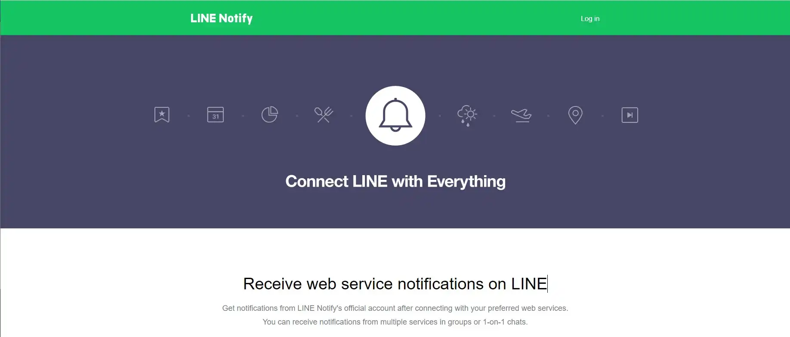

# LINE Notify API_Template for Python3
## Summary
__You can use LINE Notify API Test Request by Python3__
>__Note__ You can confirm for LINE Notify API Tips at Wiki.

## References
- About LINE Notify:[notify-bot.line.me/ ](https://notify-bot.line.me/)
- About LINE Notify REST API:[notify-bot.line.me/doc/](https://notify-bot.line.me/doc/)
